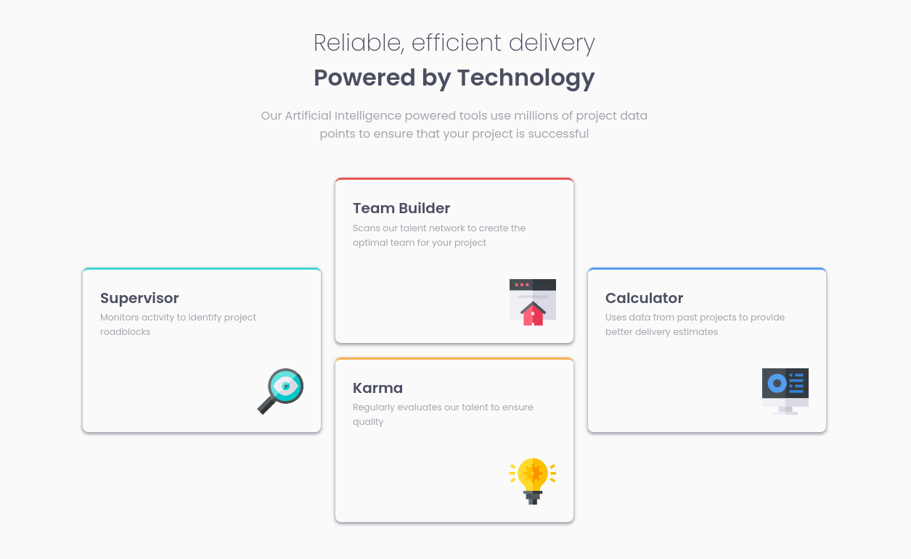

# Frontend Mentor - Four card feature section solution

This is a solution to the [Four card feature section challenge on Frontend Mentor](https://www.frontendmentor.io/challenges/four-card-feature-section-weK1eFYK). Frontend Mentor challenges help you improve your coding skills by building realistic projects. 

### Screenshot

### Links

- Solution URL: [See in Frontend Mentor](https://www.frontendmentor.io/solutions/four-cards-in-react-css-grids-SBa1yiUrt4)
- Live Site URL: [Hosted on Vercel](https://fm-four-cards-livid.vercel.app/)

## My process

### Built with
- [React](https://reactjs.org/) - JS library
- Mobile-first workflow
- Semantic HTML5 markup
- CSS custom properties
- Flexbox
- CSS Grid

## Author

- Website - [keiner mendoza](https://keinermendoza.com)
- Frontend Mentor - [@keinermendoza](https://www.frontendmentor.io/profile/keinermendoza)

refresh